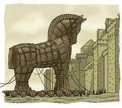

# Sécurité - Écriture d'un Troyen - Aubert & Vuilliomenet

## Contexte
Dans le cadre du cours de sécurité informatique, nous nous sommes intéressés aux logiciels malveillants et plus particulièrement aux Troyens. Les Troyens sont des programmes dissimulés dans d'autres programmes que l'on pense sains et bienveillants. Cependant, après avoir installé ce logiciel "façade", le programme malveillant commencera à agir discrètement.

Son nom ne vient évidemment pas de nulle part, il est tiré de l'histoire du cheval de Troie qui avait été offert en guise de félicitations aux vainqueurs alors qu'à l'intérieur se cachaient des guerriers prêts à tuer leurs adversaires une fois qu'ils ne s'y attendraient plus.

<figure>
    
    <figcaption>Figure 1 : Cheval de Troie</figcaption>
</figure>

Le même principe est appliqué dans un cheval de Troie informatique. L'attaquant va tenter de dissimuler au mieux son programme malveillant dans un logiciel utile qui semble provenir d'une source fiable ou du moins pas trop douteuse. On retrouve régulièrement cette stratégie dans des logiciels craqués que l'on peut gratuitement télécharger sur internet.

Notre travail sera d'élaborer un Troyen qui soit assez crédible pour persuader nos cibles que notre logiciel façade est digne de confiance pour qu'ils l'installent.

Nous avons vu qu'il existait un grand nombre de bonnes pratiques en sécurité informatique pour éviter toute intrusion dans ses systèmes, mais nous savons aussi que le maillon le plus vulnérable est toujours l'être humain. La mise en place d'un Troyen n'est pas l'attaque informatique la plus technique, mais elle demande plutôt une certaine part de social engineering.

Par contre, nous avons appris qu'une bonne gestion des logs permettait de repérer très rapidement les comportements anormaux et les intrusions dans un système informatique. C'est pourquoi nous devrons aussi porter une attention particulière à rendre notre programme malveillant discret et non trop actif.

## État de l'art

Un cheval de Troie n'est pas forcément un grand logiciel comme un antivirus qui possède aussi un programme malveillant, ça peut aussi être une image ou un pdf qui est en réalité un exécutable.
Cette méthode d'intrusion dans un système est largement utilisée par les Ethical hackers qui tentent d'exploiter les failles humaines.

Un cheval de Troie peut être écrit dans n'importe quel language de programmation mais il est plus facile de le faire en C/C++ afin de bypasser les permissions.

### Troyen dans un fichier jpg ou autre fichier

Il semble très facile de mettre en place un Troyen dans un fichier jpg d'après le post de *Gourav Dhar* sur le site *InfoSec Write-ups*. Il explique aussi que sa marche à suivre fonctionne pour les pdf ou d'autres extensions de fichiers.

Lien sur son post : https://infosecwriteups.com/how-i-created-a-trojan-malware-ethical-hacking-82239a6b64c6

### Troyen dans un 

## Mise en place concrète

**TODO**

## Résultats

***TODO*

## Références

### Sites internet

 - **Wikipédia**, Cheval de Troie, https://fr.wikipedia.org/wiki/Cheval_de_Troie
 - **Wikipédia**, Cheval de Troie (informatique), https://fr.wikipedia.org/wiki/Cheval_de_Troie_(informatique)
 - **InfoSec Write-ups**, How I created a Trojan malware - Ethical Hacking, https://infosecwriteups.com/how-i-created-a-trojan-malware-ethical-hacking-82239a6b64c6

### Illustrations

 - Figure 1 : http://www.droits-justice-et-securites.fr/intrusion/un-cheval-de-troie-dans-ma-messagerie/
